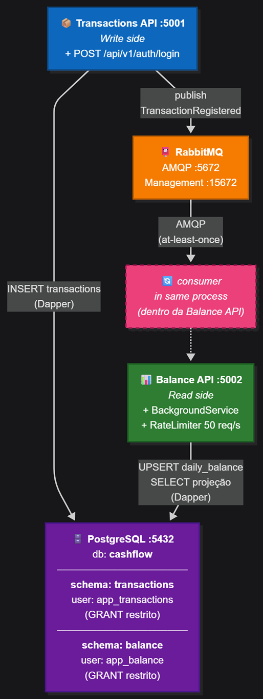

# CashFlow — Controle de Lançamentos e Saldo Diário Consolidado

[](https://github.com/luishpp/cash-flow/actions/workflows/ci.yml)

Sistema para controle de fluxo de caixa diário de um comerciante, com registro de lançamentos (débitos e créditos) e consulta de saldo diário consolidado.

> **Desafio Arquiteto de Software.** Toda a análise, ADRs (decisões com trade-offs), RNFs (requisitos não-funcionais) e diagramas C4 estão em [`docs/`](docs/). Comece por [`docs/analysis/analise-desafio-arquiteto.md`](docs/analysis/analise-desafio-arquiteto.md).

## Glossário de termos

O **domínio** é descrito em português (linguagem do negócio); o **código** usa identificadores em inglês. Este glossário liga os dois.

| Termo de negócio (pt-br) | Identificador no código (en-us) | Definição |
|---|---|---|
| **Lançamento** | `Transaction` | Movimentação financeira individual (débito ou crédito) registrada pelo comerciante. Persistido em `transactions.transactions`. |
| **Saldo consolidado / Consolidado** | `Balance` *(bounded context)* | Projeção de leitura agregada por dia, derivada dos lançamentos do dia. Implementado pela `CashFlow.Balance.API`. |
| **Saldo diário** | `DailyBalance` *(entidade)* | A projeção propriamente dita — uma linha por data com `total_credits`, `total_debits` e `balance` (derivado). Persistida em `balance.daily_balance`. |
| **Evento de lançamento registrado** | `TransactionRegistered` | Evento de domínio publicado pela Transactions API após persistir um lançamento; consumido pela Balance API para atualizar a projeção. |
| **Crédito / Débito** | `Credit` / `Debit` | Tipos de lançamento (entrada / saída financeira). |
| **Idempotência do consumer** | `processed_events` | Tabela auxiliar que garante que reentregas at-least-once do RabbitMQ não dupliquem o saldo. |

**Por que essa separação:** mantém a análise de negócio (persona, jornada, RNFs) legível para stakeholders brasileiros, sem sacrificar a uniformidade do código (identificadores en-us, comentários em pt-br).

## Arquitetura

O sistema é composto por **dois serviços independentes** que se comunicam de forma assíncrona via mensageria:

- **Transactions API** — registra débitos e créditos (write side). Também hospeda `POST /api/v1/auth/login` para emissão de JWT.
- **Balance API** — expõe o saldo diário consolidado (read side). Hospeda um `BackgroundService` que consome eventos `TransactionRegistered` e mantém a projeção atualizada.

A Transactions API **não depende** da Balance API. Se o consumer ou a Balance API caírem, os lançamentos continuam operando normalmente e as mensagens ficam na fila até serem processadas.



> Fonte editável: [`docs/diagrams/arquitetura-overview.mmd`](docs/diagrams/arquitetura-overview.mmd)

**Decisões-chave** (detalhes em [`docs/adrs/`](docs/adrs/) — 25 ADRs no total):

- **CQRS** — separação write/read ([ADR-001](docs/adrs/adr-001-cqrs.md)).
- **EDA com RabbitMQ + MassTransit** — desacoplamento temporal; portabilidade para Azure Service Bus ([ADR-002](docs/adrs/adr-002-rabbitmq-masstransit.md)).
- **1 PostgreSQL + 2 schemas com GRANTs** — isolamento lógico real, menos cerimônia que 2 databases ([ADR-003](docs/adrs/adr-003-postgres-schemas.md)).
- **Consumer como `BackgroundService`** no MVP; processo dedicado é evolução documentada ([ADR-004](docs/adrs/adr-004-consumer-hostedservice.md)).
- **Polly Retry** com idempotência via tabela `processed_events` ([ADR-005](docs/adrs/adr-005-polly-retry.md), [ADR-011](docs/adrs/adr-011-idempotency.md)).
- **Reliability: Outbox + Delayed Redelivery + DLQ admin** ([ADR-025](docs/adrs/adr-025-outbox-and-dlq.md)) — outbox transacional no publisher fecha a janela do [ADR-007](docs/adrs/adr-007-publish-after-commit.md); `UseDelayedRedelivery` no consumer (1min/5min/15min) cobre outages prolongados; `POST /api/v1/admin/errors/redeliver` na Balance API reprocessa a DLQ visível.
- **Rate limiting nativo** do ASP.NET Core 10 ([ADR-006](docs/adrs/adr-006-rate-limiting.md)).
- **Runtime .NET 10 (LTS)** com runway até Nov/2028 ([ADR-014](docs/adrs/adr-014-dotnet-10.md)).
- **Rich Domain Model** + **Dapper** + **DbUp** ([ADR-009](docs/adrs/adr-009-rich-domain-model.md), [ADR-010](docs/adrs/adr-010-dapper.md)).
- **Application Services como dispatcher** (sem MediatR) ([ADR-015](docs/adrs/adr-015-application-services-no-mediatr.md)).
- **JWT Bearer (15min) + Authorization Policies + hash Argon2id + lockout + refresh tokens com rotação** ([ADR-016](docs/adrs/adr-016-jwt-authentication.md), [ADR-021](docs/adrs/adr-021-argon2id-password-hashing.md), [ADR-023](docs/adrs/adr-023-account-lockout.md), [ADR-024](docs/adrs/adr-024-refresh-tokens-rotation.md)).
- **Testes de arquitetura** (NetArchTest) + **BDD de domínio + E2E** (Reqnroll pt-BR + WebApplicationFactory + Testcontainers) ([ADR-012](docs/adrs/adr-012-architecture-tests.md), [ADR-017](docs/adrs/adr-017-bdd-reqnroll.md), [ADR-022](docs/adrs/adr-022-bdd-e2e-webapplicationfactory.md)).
- **CI** (GitHub Actions) + **Load test** (NBomber) + **Mutation testing** (Stryker.NET) ([ADR-018](docs/adrs/adr-018-github-actions-ci.md), [ADR-019](docs/adrs/adr-019-load-test-nbomber.md), [ADR-020](docs/adrs/adr-020-stryker-mutation-testing.md)).

Diagramas C4 completos em [`docs/diagrams/`](docs/diagrams/).

## Pré-requisitos

- [Docker Desktop](https://www.docker.com/products/docker-desktop/) instalado e rodando.
- Portas disponíveis: `5001`, `5002`, `5432`, `5672`, `15672`.

Não é necessário ter .NET SDK, PostgreSQL ou RabbitMQ instalados localmente para subir os serviços — tudo roda em containers. .NET 10 SDK só é necessário para rodar `dotnet test` ou o load test localmente.

## Como executar

```bash
# Subir todos os serviços
docker compose up --build -d

# Verificar se tudo subiu
docker compose ps

# Ver logs em tempo real
docker compose logs -f
```

### Acessos após subir

| Serviço | URL |
|---|---|
| Transactions API (Swagger) | http://localhost:5001/swagger |
| Balance API (Swagger) | http://localhost:5002/swagger |
| RabbitMQ Management | http://localhost:15672 (guest/guest) |
| Health Check (Transactions) | http://localhost:5001/health/ready |
| Health Check (Balance) | http://localhost:5002/health/ready |

### Parar os serviços

```bash
docker compose down

# Remover também volumes (dados do banco):
docker compose down -v
```

## Autenticação (JWT Bearer)

Ambos os APIs exigem token JWT. Faça login na Transactions API e use o mesmo token nas duas APIs (mesma chave/audience — [ADR-016](docs/adrs/adr-016-jwt-authentication.md)).

**Usuário demo** (criado por `DemoUserSeeder` no primeiro startup, hash Argon2id armazenado em `transactions.app_users`):

| Username | Password | Role |
|---|---|---|
| `carlos` | `S3cret!ChangeMe` | `Merchant` |

> ⚠️ **MVP**: usuário demo seedado automaticamente. A senha **nunca** é persistida em claro — apenas o hash Argon2id (formato PHC, OWASP defaults: 64 MiB, 3 iterações). Em produção: lockout, refresh tokens, RSA/ECDSA + JWKS, OIDC via Microsoft Entra ID — caminho de evolução em [ADR-016](docs/adrs/adr-016-jwt-authentication.md) e [ADR-021](docs/adrs/adr-021-argon2id-password-hashing.md).

**Obter access + refresh tokens:**

```bash
curl -X POST http://localhost:5001/api/v1/auth/login \
  -H "Content-Type: application/json" \
  -d '{"username":"carlos","password":"S3cret!ChangeMe"}'
```

Resposta:

```json
{
  "accessToken": "eyJhbGciOi...",
  "tokenType": "Bearer",
  "expiresAtUtc": "2026-05-23T15:15:00+00:00",
  "role": "Merchant",
  "refreshToken": "9aQ7VxN3kP...",
  "refreshTokenExpiresAtUtc": "2026-05-30T15:00:00+00:00"
}
```

**Renovar access token (rotação do refresh — ADR-024):**

```bash
curl -X POST http://localhost:5001/api/v1/auth/refresh \
  -H "Content-Type: application/json" \
  -d '{"refreshToken":"9aQ7VxN3kP..."}'
```

Retorna um par novo (access + refresh). O refresh anterior é **revogado** — chamar `/refresh` com ele de novo retorna 401.

**Logout:**

```bash
curl -X POST http://localhost:5001/api/v1/auth/logout \
  -H "Content-Type: application/json" \
  -d '{"refreshToken":"9aQ7VxN3kP..."}'
```

Retorna 204. O access token continua válido até expirar (15 min) — aceitável dada a janela curta.

**Lockout (ADR-023):** 5 tentativas falhas consecutivas travam a conta por 15 min. Mesmo a senha correta retorna 401 durante o lockout.

**Via Swagger UI:** clique em **Authorize** (canto superior direito), cole `Bearer <accessToken>` (o valor completo do header — inclua o prefixo `Bearer`), e teste qualquer endpoint protegido.

## Endpoints

> Todos os endpoints abaixo (exceto `/auth/login`) exigem `Authorization: Bearer <token>`.

### Transactions API — `http://localhost:5001`

| Método | Rota | Descrição |
|---|---|---|
| `POST` | `/api/v1/auth/login` | Emite access JWT (15min) + refresh token (7d) — anônimo |
| `POST` | `/api/v1/auth/refresh` | Rotaciona refresh, emite par novo — anônimo |
| `POST` | `/api/v1/auth/logout` | Revoga o refresh token — anônimo |
| `POST` | `/api/v1/transactions` | Registra um array de transações em batch transacional (tudo-ou-nada) |
| `GET`  | `/api/v1/transactions/{id}` | Consulta uma transação específica |
| `GET`  | `/api/v1/transactions?date={yyyy-MM-dd}` | Lista transações de uma data |

> Body é sempre um **array** — envie `[ { ... } ]` para registrar uma só. Batch é transacional (tudo-ou-nada): se qualquer item falhar (validação ou domínio), nada é persistido. Resposta é sempre 201 com array de `TransactionResponse`.

**Exemplo — registrar uma transação (array com 1 item):**

```bash
TOKEN="eyJhbGciOi..."
curl -X POST http://localhost:5001/api/v1/transactions \
  -H "Authorization: Bearer $TOKEN" \
  -H "Content-Type: application/json" \
  -d '[
    { "type": "credit", "amount": 150.00, "description": "Venda do dia", "movementDate": "2026-05-22" }
  ]'
```

**Exemplo — batch (crédito + débito no mesmo request):**

```bash
curl -X POST http://localhost:5001/api/v1/transactions \
  -H "Authorization: Bearer $TOKEN" \
  -H "Content-Type: application/json" \
  -d '[
    { "type": "credit", "amount": 150.00, "description": "Venda do dia", "movementDate": "2026-05-22" },
    { "type": "debit",  "amount":  45.50, "description": "Compra de estoque", "movementDate": "2026-05-22" }
  ]'
```

### Balance API — `http://localhost:5002`

| Método | Rota | Descrição |
|---|---|---|
| `GET` | `/api/v1/balance/{date}` | Saldo consolidado de uma data específica |
| `GET` | `/api/v1/balance?from={date}&to={date}` | Saldo consolidado por período — totais agregados no topo + detalhamento diário em `days[]` |
| `GET` | `/api/v1/admin/errors/count` | Quantidade de mensagens na DLQ (`balance.transaction-registered_error`) |
| `POST` | `/api/v1/admin/errors/redeliver?max={N}` | Move mensagens da DLQ de volta para a fila principal (reprocessamento) |

**Exemplo — consultar saldo do dia:**

```bash
curl http://localhost:5002/api/v1/balance/2026-05-22 \
  -H "Authorization: Bearer $TOKEN"
```

**Resposta esperada:**

```json
{
  "date": "2026-05-22",
  "totalCredits": 150.00,
  "totalDebits": 45.50,
  "balance": 104.50,
  "updatedAt": "2026-05-22T13:42:11+00:00"
}
```

**Exemplo — consultar período:**

```bash
curl "http://localhost:5002/api/v1/balance?from=2026-05-22&to=2026-05-25" \
  -H "Authorization: Bearer $TOKEN"
```

**Resposta esperada:**

```json
{
  "from": "2026-05-22",
  "to": "2026-05-25",
  "totalCredits": 2250.00,
  "totalDebits": 136.50,
  "balance": 2113.50,
  "days": [
    { "date": "2026-05-22", "totalCredits": 1200.00, "totalDebits": 136.50, "balance": 1063.50, "updatedAt": "2026-05-25T23:10:35+00:00" },
    { "date": "2026-05-25", "totalCredits": 1050.00, "totalDebits": 0,      "balance": 1050.00, "updatedAt": "2026-05-25T23:10:35+00:00" }
  ]
}
```

> O topo (`totalCredits`/`totalDebits`/`balance`) espelha o shape de `/balance/{date}` — é o mesmo objeto consolidado em escala de período. `days[]` traz os mesmos campos por dia (só dias com movimento).

## Reliability — Outbox, retry e DLQ

**Publisher (Transactions API):** o INSERT da transação e a gravação do evento em `transactions.outbox_events` ocorrem na **mesma transação**. Um `OutboxDispatcher` (`BackgroundService`) drena o outbox em ordem FIFO (`ORDER BY seq`) e publica no broker. Falha no publish marca a entry como `attempts++` + `last_error` — próximo ciclo retenta. Fecha a janela do publish-after-commit do [ADR-007](docs/adrs/adr-007-publish-after-commit.md).

**Consumer (Balance API) — dois níveis de retry:**

1. **In-process (Polly):** 3 tentativas com backoff exponencial até ~3s — cobre transientes rápidos.
2. **Broker (Delayed Redelivery):** após esgotar Polly, `UseDelayedRedelivery` reagenda em **1min → 5min → 15min** via plugin `rabbitmq_delayed_message_exchange` (imagem custom em [`infra/rabbitmq/Dockerfile`](infra/rabbitmq/Dockerfile)). Cobre outage de banco/dependência.

**DLQ:** após esgotar todos os retries, a mensagem vai para `balance.transaction-registered_error` (queue automática da MassTransit) — **não se perde**. Visibilidade e ação via:

```bash
# Quantas mensagens na DLQ agora?
curl http://localhost:5002/api/v1/admin/errors/count -H "Authorization: Bearer $TOKEN"

# Move tudo de volta pra fila principal (após corrigir a causa)
curl -X POST http://localhost:5002/api/v1/admin/errors/redeliver -H "Authorization: Bearer $TOKEN"

# Ou um lote: ?max=10
curl -X POST "http://localhost:5002/api/v1/admin/errors/redeliver?max=10" -H "Authorization: Bearer $TOKEN"
```

A tabela `balance.processed_events` (idempotência — ADR-011) garante que reentregas via redelivery ou redeliver manual não dupliquem o saldo.

## Executar os testes

```bash
# Testes unitários (Rich Domain: Transaction, Money, DailyBalance, etc.)
dotnet test ./tests/CashFlow.UnitTests

# Testes de arquitetura (fitness functions — NetArchTest)
dotnet test ./tests/CashFlow.Architecture.Tests

# Testes BDD (Reqnroll, pt-BR — ADR-017 e ADR-022)
# Inclui cenários E2E via WebApplicationFactory + Testcontainers Postgres → requer Docker.
dotnet test ./tests/CashFlow.Bdd.Tests

# Tudo de uma vez (114 testes: 91 unit + 8 architecture + 15 BDD)
dotnet test
```

### Teste de carga (RNF-02 — 50 req/s, máx 5% perda)

```bash
# Pré-requisito: docker compose up --build -d
dotnet run --project tests/CashFlow.LoadTests --configuration Release
```

3.000 requisições a 50 req/s contra `GET /api/v1/balance/{date}` com validação automática do critério do RNF-02. Detalhes em [`tests/CashFlow.LoadTests/README.md`](tests/CashFlow.LoadTests/README.md) e [ADR-019](docs/adrs/adr-019-load-test-nbomber.md).

### Testes de mutação (Stryker.NET)

```bash
dotnet tool restore                                              # uma vez
cd tests/CashFlow.UnitTests
dotnet stryker --project CashFlow.Transactions.API.csproj        # → ~91.09%
dotnet stryker --project CashFlow.Balance.API.csproj             # → 100%
```

Mutation score ≥ 70% (configurado em `tests/CashFlow.UnitTests/stryker-config.json`). Reports HTML em `tests/CashFlow.UnitTests/StrykerOutput/<timestamp>/reports/mutation-report.html`. Também disponível como **workflow_dispatch** manual no GitHub Actions ([`.github/workflows/mutation.yml`](.github/workflows/mutation.yml)). Detalhes em [ADR-020](docs/adrs/adr-020-stryker-mutation-testing.md).

## Integração Contínua

Pipeline GitHub Actions ([`.github/workflows/ci.yml`](.github/workflows/ci.yml)) dispara em `push: main` e `pull_request`:

1. **Build** em configuração `Release` (.NET 10 SDK).
2. **Unit tests** — 85 testes de domínio.
3. **Architecture tests** — 8 fitness functions de Clean Architecture.
4. **BDD tests** — 15 cenários Reqnroll pt-BR (domínio + E2E).
5. **Upload** de TRX + cobertura como artifact (retenção 7 dias).

Load test (NBomber) fica fora do CI automático por exigir stack completa — decisão documentada em [ADR-018](docs/adrs/adr-018-github-actions-ci.md).

## Stack tecnológica

| Camada | Tecnologia | ADR |
|---|---|---|
| Runtime | .NET 10 / C# (LTS) | [ADR-014](docs/adrs/adr-014-dotnet-10.md) |
| API | ASP.NET Core (Controllers) + Swagger | [ADR-013](docs/adrs/adr-013-security-observability.md) |
| Autenticação | JWT Bearer (HMAC-SHA256, 15 min) + Authorization Policies + hash Argon2id + lockout + refresh tokens rotativos | [ADR-016](docs/adrs/adr-016-jwt-authentication.md), [ADR-021](docs/adrs/adr-021-argon2id-password-hashing.md), [ADR-023](docs/adrs/adr-023-account-lockout.md), [ADR-024](docs/adrs/adr-024-refresh-tokens-rotation.md) |
| Persistência | Dapper + Npgsql | [ADR-010](docs/adrs/adr-010-dapper.md) |
| Migrations | DbUp (SQL versionado) | [ADR-010](docs/adrs/adr-010-dapper.md) |
| Banco | PostgreSQL 16 | [ADR-003](docs/adrs/adr-003-postgres-schemas.md) |
| Mensageria | RabbitMQ + MassTransit | [ADR-002](docs/adrs/adr-002-rabbitmq-masstransit.md) |
| Validação | FluentValidation | [ADR-013](docs/adrs/adr-013-security-observability.md) |
| Rate Limiting | `Microsoft.AspNetCore.RateLimiting` | [ADR-006](docs/adrs/adr-006-rate-limiting.md) |
| Resiliência | Polly v8 (Retry + Backoff + Jitter) | [ADR-005](docs/adrs/adr-005-polly-retry.md) |
| Dispatcher | Application Services + DI direta (sem MediatR) | [ADR-015](docs/adrs/adr-015-application-services-no-mediatr.md) |
| Testes Unitários | xUnit + FluentAssertions + Moq | — |
| Testes de Arquitetura | NetArchTest.Rules | [ADR-012](docs/adrs/adr-012-architecture-tests.md) |
| Testes BDD (domínio) | Reqnroll (sucessor open-source do SpecFlow) | [ADR-017](docs/adrs/adr-017-bdd-reqnroll.md) |
| Testes BDD (E2E) | Reqnroll + WebApplicationFactory + Testcontainers Postgres | [ADR-022](docs/adrs/adr-022-bdd-e2e-webapplicationfactory.md) |
| Testes de Carga | NBomber 6 | [ADR-019](docs/adrs/adr-019-load-test-nbomber.md) |
| Testes de Mutação | Stryker.NET 4 (local tool) | [ADR-020](docs/adrs/adr-020-stryker-mutation-testing.md) |
| CI | GitHub Actions (build + 3 suítes em PR; mutação em `workflow_dispatch`) | [ADR-018](docs/adrs/adr-018-github-actions-ci.md), [ADR-020](docs/adrs/adr-020-stryker-mutation-testing.md) |
| Health Checks | `Microsoft.Extensions.Diagnostics.HealthChecks` | [ADR-013](docs/adrs/adr-013-security-observability.md) |
| Logs | Serilog (console) | [ADR-013](docs/adrs/adr-013-security-observability.md) |
| Containers | Docker + Docker Compose | [ADR-008](docs/adrs/adr-008-docker-compose.md) |

## Documentação do projeto

| Documento | Descrição |
|---|---|
| [`docs/architecture.md`](docs/architecture.md) | **Visão arquitetural unificada** — estilo (CQRS + EDA + Clean Architecture + DDD), estrutura de módulos, regra de dependência, fluxos principais e bounded contexts. Leitura de ~15 min. |
| [`docs/analysis/analise-desafio-arquiteto.md`](docs/analysis/analise-desafio-arquiteto.md) | Análise completa: contexto, persona, jornada, decisões arquiteturais, padrões aplicados, estrutura, evoluções futuras |
| [`docs/rnfs/`](docs/rnfs/) | **9 RNFs** em arquivos individuais (Disponibilidade, Carga, Escalabilidade, Resiliência, Segurança, Padrões, Integração, Manutenibilidade, Observabilidade) |
| [`docs/adrs/`](docs/adrs/) | **25 ADRs** em arquivos individuais com contexto, trade-offs explícitos, alternativas descartadas e configurações concretas |
| [`docs/diagrams/`](docs/diagrams/) | Diagramas C4 (Contexto, Containers, Componentes) — fonte `.mmd` + PNG embedado em cada `.md` |
| [`docs/challenge/`](docs/challenge/) | PDF original do desafio |
| [`docs/references/`](docs/references/) | Material de estudo: dicionário arquitetural, RNFs→decisões, vaga, plano de preparação |

## Estrutura do projeto

```text
/src
  /CashFlow.Transactions.API    → Write side
                                   (Domain/, Application/, Infrastructure/,
                                    Controllers/, Infrastructure/Migrations/)
  /CashFlow.Balance.API         → Read side + BackgroundService consumer
                                   (Domain/, Application/, Infrastructure/,
                                    Controllers/, Consumers/, Migrations/)
  /CashFlow.Shared              → Contratos de eventos + Security (JWT/Policies)

/tests
  /CashFlow.UnitTests              → Domínio (Transaction, Money, DailyBalance, AppUser, ...)
  /CashFlow.Architecture.Tests     → Fitness functions (NetArchTest)
  /CashFlow.Bdd.Tests              → Reqnroll pt-BR: domínio + E2E (WebApplicationFactory + Testcontainers)
  /CashFlow.LoadTests              → NBomber — validação empírica do RNF-02

/.github/workflows
  ci.yml                           → CI: build + 3 suítes de teste (PR/push)
  mutation.yml                     → Stryker.NET (workflow_dispatch manual)

/.config
  dotnet-tools.json                → Local tools (Stryker)

/infra
  /postgres/init.sql               → Criação de users + schemas + GRANTs
  /rabbitmq/Dockerfile             → Imagem custom com plugin delayed-message-exchange (ADR-025)

/docs                                Documentação arquitetural (25 ADRs + 9 RNFs)
docker-compose.yml                   Orquestração de todos os serviços
CashFlow.sln                         Solution file
README.md                            Este arquivo
```

**3 projetos de produção + 4 de teste/carga.** Separação por pastas internas (`Domain/`, `Application/`, `Infrastructure/`) dentro de cada API demonstra Clean Architecture sem cerimônia de 11 projetos para um domínio com 2 entidades.

## Evoluções naturais (não-MVP)

A documentação registra evoluções priorizadas em [`docs/analysis/analise-desafio-arquiteto.md` § 13](docs/analysis/analise-desafio-arquiteto.md). Destaques alinhados a contextos enterprise:

- **API Gateway (Azure APIM / Apigee)** — rate limiting distribuído, validação centralizada de JWT, transformação de payload, developer portal.
- **OAuth 2.0 / OIDC com Microsoft Entra ID** — substitui `DemoUserSeeder` por IdP corporativo; APIs só validam JWT emitido pelo IdP.
- **MFA (TOTP RFC 6238)** — próximo passo natural do stack de auth (Argon2id + lockout + refresh tokens já implementados).
- **Cenário BDD cross-API** (Transactions → RabbitMQ → Balance) via Testcontainers RabbitMQ — evolução natural do [ADR-022](docs/adrs/adr-022-bdd-e2e-webapplicationfactory.md).
- **OpenTelemetry completo** — distributed tracing propagado pelo broker (W3C TraceContext em headers AMQP) + Application Insights.
- ~~**Outbox Pattern**~~ — **já implementado** via outbox custom em Dapper ([ADR-025](docs/adrs/adr-025-outbox-and-dlq.md)). A versão `UseEntityFrameworkOutbox` do MassTransit foi descartada porque exigiria abandonar Dapper.
- **Migração para Azure Service Bus** — trocar broker via configuração do MassTransit, sem mudar código de negócio.
- **Cron noturno do Stryker** + `--since main` em PR — mutation testing sem clique manual e com custo viável em PR.
- **Consumer em processo dedicado** (`CashFlow.Balance.Worker`) quando volume justificar.
