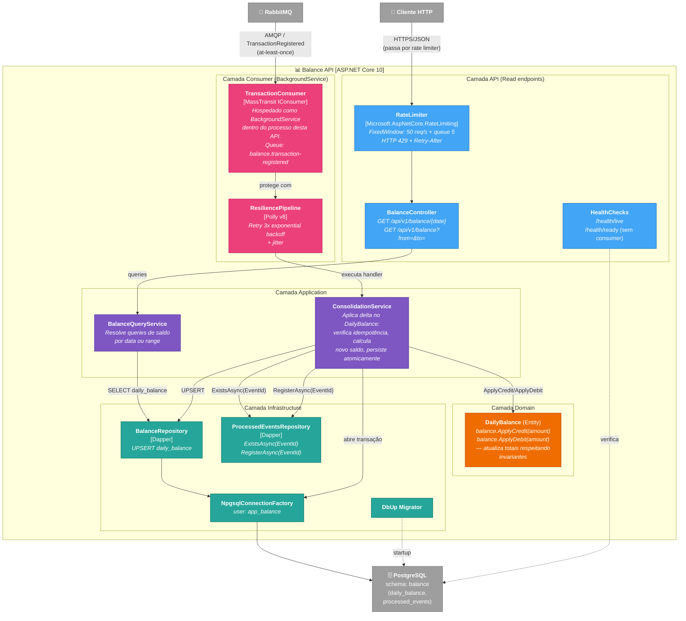

# C4 Level 3 — Componentes da Balance API (+ Consumer)

**Pergunta que responde:** Quais componentes internos formam a `CashFlow.Balance.API`, incluindo o `BackgroundService` consumer que mantém a projeção atualizada?



## Fluxo de "Aplicar Transaction ao DailyBalance" (consumer)

1. RabbitMQ entrega mensagem `TransactionRegistered` para `TransactionConsumer` (queue `balance.transaction-registered`).
2. `Polly ResiliencePipeline` envolve a execução — se falha transitória (timeout no banco), retenta com backoff 1s/2s/4s + jitter.
3. `ConsolidationService.ApplyAsync(evt, consumerName)`:
   1. Abre transação Dapper (`IUnitOfWork`).
   2. `EventsRepo.ExistsAsync(EventId, consumerName)` — se `true`, **retorna sem fazer nada** (idempotente; mensagem é `Ack`ada).
   3. Caso contrário: carrega ou cria `DailyBalance` e chama `ApplyCredit`/`ApplyDebit` conforme `evt.Type` (Rich Domain — invariantes respeitadas).
   4. `BalanceRepo.UpsertAsync(balance, ct)` persiste.
   5. `EventsRepo.RegisterAsync(EventId, consumerName, ct)` marca como processado.
   6. **Commit atômico**: saldo aplicado + evento marcado em uma única transação. Crash entre os dois é impossível.
4. MassTransit faz `Ack` para o RabbitMQ. Em caso de exception não-recuperável, faz `Nack` e a mensagem volta para a fila (será reprocessada — idempotência garante segurança).

## Fluxo de "Consultar Balance" (query)

1. `Cliente` envia `GET /api/v1/balance/2026-05-22`.
2. `RateLimiter` aplica fixed window — se acima de 50 req/s + queue 5: **HTTP 429** com `Retry-After`.
3. `BalanceController.GetByDate(date)` chama `BalanceQueryService`.
4. `QueryService` faz `SELECT * FROM balance.daily_balance WHERE date = @date` via Dapper — leitura **O(1)** porque a projeção já está pronta.
5. Retorna **HTTP 200** com `{ date, totalCredits, totalDebits, balance, updatedAt }`.

## Por que healthcheck `/health/ready` não inclui consumer

Decisão deliberada para que falha no consumer não marque a API como `unhealthy` ([RNF-01](../rnfs/rnf-01-disponibilidade.md) — leitura segue disponível mesmo com consumer degradado). Estado do consumer é exposto via métricas (futuro: OpenTelemetry / queue depth no RabbitMQ).

## Tabelas no schema `balance`

```sql
CREATE TABLE balance.daily_balance (
    date            DATE PRIMARY KEY,
    total_credits   NUMERIC(18,2) NOT NULL DEFAULT 0,
    total_debits    NUMERIC(18,2) NOT NULL DEFAULT 0,
    updated_at      TIMESTAMPTZ   NOT NULL DEFAULT NOW()
);
-- balance é derivado em código: TotalCredits - TotalDebits.

CREATE TABLE balance.processed_events (
    event_id        UUID         NOT NULL,
    consumer_name   VARCHAR(100) NOT NULL,
    processed_at    TIMESTAMPTZ  NOT NULL DEFAULT NOW(),
    PRIMARY KEY (event_id, consumer_name)
);
CREATE INDEX idx_processed_events_at ON balance.processed_events (processed_at);
```

## Estrutura de pastas correspondente

```text
CashFlow.Balance.API/
├── Controllers/
│   └── BalanceController.cs
├── Consumers/
│   └── TransactionConsumer.cs
├── Domain/
│   ├── Entities/DailyBalance.cs
│   └── Exceptions/DomainException.cs
├── Application/
│   ├── Services/{IBalanceQueryService, BalanceQueryService}.cs
│   ├── Services/{IConsolidationService, ConsolidationService}.cs
│   └── DTOs/BalanceResponse.cs
├── Infrastructure/
│   ├── Persistence/{NpgsqlConnectionFactory, DapperUnitOfWork}.cs
│   ├── Repositories/{IBalanceRepository, BalanceRepository}.cs
│   ├── Repositories/{IProcessedEventsRepository, ProcessedEventsRepository}.cs
│   └── Migrations/
│       ├── MigrationRunner.cs
│       └── Scripts/{001_create_schema, 002_create_daily_balance, 003_create_processed_events}.sql
└── Program.cs
```
