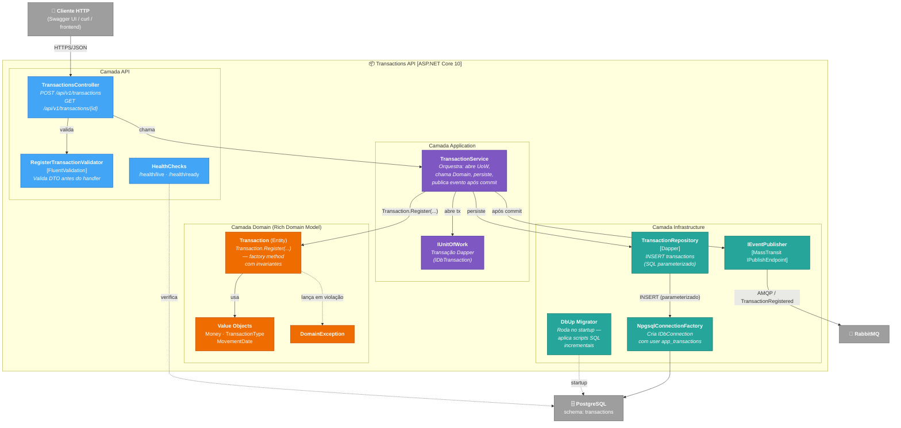

# C4 Level 3 — Componentes da Transactions API

**Pergunta que responde:** Quais componentes internos formam a `CashFlow.Transactions.API`, e como o fluxo de registro de uma transação atravessa as camadas?



## Fluxo de "Registrar Transaction" (golden path)

1. `Cliente` envia `POST /api/v1/transactions` com `{ type, amount, description, movementDate }`.
2. `TransactionsController` recebe DTO; `FluentValidation` valida formato/limites — se falha, retorna **HTTP 400** com detalhes.
3. Controller delega para `TransactionService.RegisterAsync(request)`.
4. `TransactionService` abre `IUnitOfWork` (begin transaction).
5. `Transaction.Register(...)` é chamada — factory method valida invariantes de domínio. Se violação, lança `DomainException` (middleware traduz para **HTTP 422**).
6. `TransactionRepository.InsertAsync(transaction, ct)` persiste via Dapper com SQL parameterizado.
7. `IUnitOfWork.CommitAsync()` confirma a transação no PostgreSQL.
8. **Após commit**, `IEventPublisher.PublishAsync(new TransactionRegistered(...))` envia evento para RabbitMQ ([ADR-007](../adrs/adr-007-publish-after-commit.md) — evita mensagens fantasma).
9. Controller retorna **HTTP 201 Created** com `Location` header.

## Regras arquiteturais validadas por NetArchTest ([ADR-012](../adrs/adr-012-architecture-tests.md))

- `Domain` (`Transaction`, VOs) **não referencia** `Infrastructure`, `Microsoft.AspNetCore.*`, `Dapper`, `Npgsql`, `MassTransit`.
- Entidades em `Domain/Entities/` **não têm setters públicos**.
- Repositórios em `Infrastructure/Repositories/` **terminam com sufixo `Repository`**.
- Interfaces de repositório **começam com `I`**.

## Estrutura de pastas correspondente

```text
CashFlow.Transactions.API/
├── Controllers/
│   └── TransactionsController.cs
├── Domain/
│   ├── Entities/{AuditableEntity, Transaction}.cs
│   ├── ValueObjects/{Money, TransactionType, MovementDate}.cs
│   └── Exceptions/DomainException.cs
├── Application/
│   ├── Services/{ITransactionService, TransactionService}.cs
│   ├── DTOs/TransactionDtos.cs
│   └── Validators/RegisterTransactionValidator.cs
├── Infrastructure/
│   ├── Persistence/{NpgsqlConnectionFactory, DapperUnitOfWork}.cs
│   ├── Repositories/{ITransactionRepository, TransactionRepository}.cs
│   ├── Messaging/{IEventPublisher, MassTransitEventPublisher}.cs
│   └── Migrations/
│       ├── MigrationRunner.cs
│       └── Scripts/{001_create_schema, 002_create_transactions_table}.sql
└── Program.cs
```
