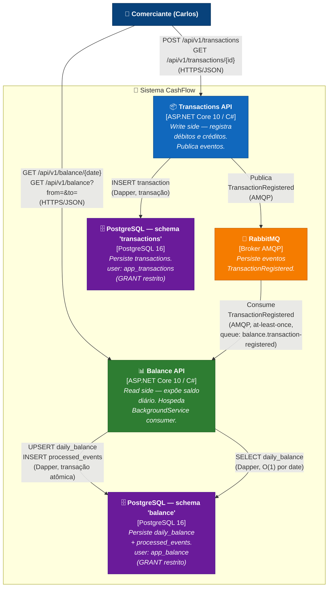

# C4 Level 2 — Diagrama de Containers

**Pergunta que responde:** Quais aplicações/serviços/databases compõem o sistema CashFlow, e como se comunicam?

## Decisões refletidas neste diagrama

| Elemento | Decisão | ADR |
|---|---|---|
| Duas APIs sem chamada direta | **CQRS** — write side (Transactions) e read side (Balance) totalmente independentes | [ADR-001](../adrs/adr-001-cqrs.md) |
| RabbitMQ entre elas | **EDA via MassTransit** — desacoplamento temporal; troca para Service Bus em produção sem mudar código | [ADR-002](../adrs/adr-002-rabbitmq-masstransit.md) |
| Schema `balance` no mesmo cluster | **1 DB + 2 schemas com GRANTs** — isolamento lógico real via permissões; mesma instância em Docker para reduzir cerimônia | [ADR-003](../adrs/adr-003-postgres-schemas.md) |
| Consumer dentro da Balance API | **HostedService no MVP** — menos containers; processo dedicado é evolução documentada | [ADR-004](../adrs/adr-004-consumer-hostedservice.md) |
| Tabela `processed_events` | **Idempotência** — RabbitMQ garante at-least-once; precisamos tratar reentregas | [ADR-011](../adrs/adr-011-idempotency.md) |

## Garantias de disponibilidade (RNF-01)

- Se **Balance API** cair: lançamentos continuam sendo registrados; eventos se acumulam na fila do RabbitMQ.
- Se **RabbitMQ** cair: lançamentos continuam sendo persistidos no banco; quando o broker volta, o `IPublishEndpoint` retoma a publicação (MassTransit gerencia a fila local). Janela de inconsistência tratada na [ADR-007](../adrs/adr-007-publish-after-commit.md); eliminada via Outbox Pattern (evolução).
- Se **Transactions API** cair: consultas ao saldo continuam funcionando normalmente.

## Próximos níveis

- **Nível 3 — Transactions:** [c4-componentes-transactions.md](c4-componentes-transactions.md)
- **Nível 3 — Balance:** [c4-componentes-balance.md](c4-componentes-balance.md)
