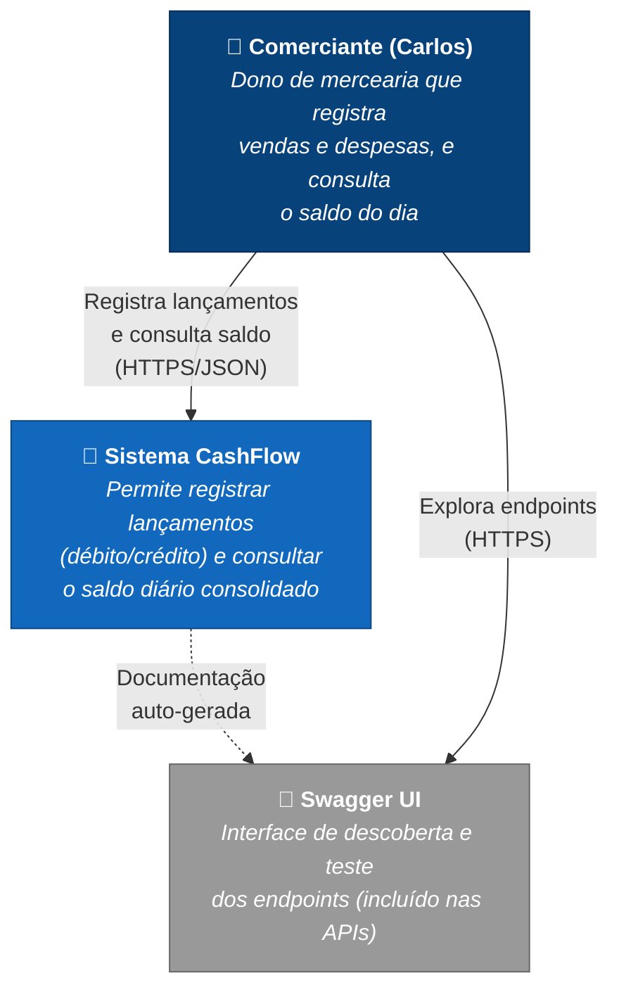

# C4 Level 1 — Diagrama de Contexto

**Pergunta que responde:** Quem usa o sistema Fluxo de Caixa e com quais sistemas externos ele conversa?

## O que esse diagrama comunica

- **Único ator humano** no escopo do desafio: o comerciante (persona Carlos — § 2 da análise).
- **Nenhuma integração externa** no MVP (sem ERP, sem banco, sem gateway de pagamento). Integrações futuras são citadas como evolução em § 13.
- A interface de uso no MVP é o **Swagger UI** das próprias APIs — frontend Web é evolução documentada.

## Próximos níveis

- **Nível 2 (Containers):** [c4-containers.md](c4-containers.md) — quebra o "Sistema de Fluxo de Caixa" em APIs, broker e banco.
- **Nível 3 (Componentes):** detalha cada API internamente.
